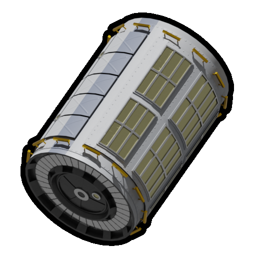
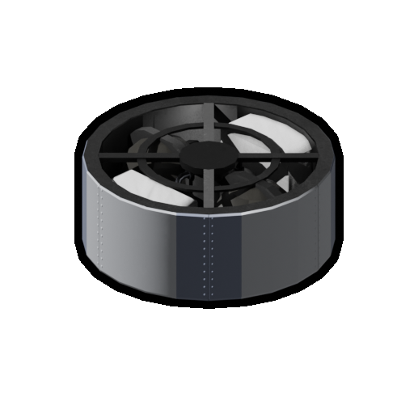
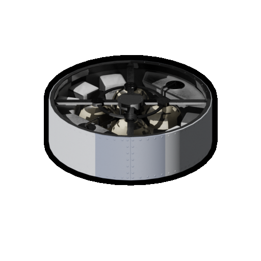
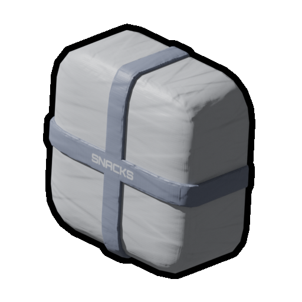
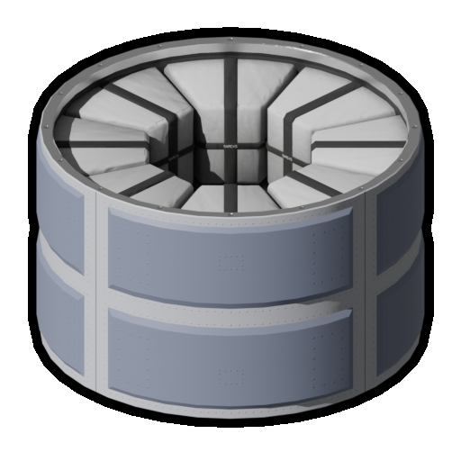
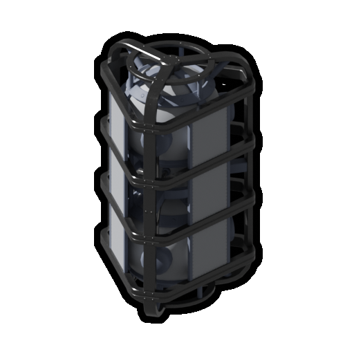

# Kerbal Life-Support System Parts Gallery

An up-to-date visual list of all parts added by this KSP2 mod.

## Converters

### GRN-250 / Medium Cylindrical Greenhouse (M)

## Combined Storage

### SCS-100 / Small Combined Storage (S)

### MCS-100 / Medium Combined Storage (M)

## Individual Storage

### PFS-10 / Portable Food Storage (XS)

### PWS-10 / Portable Water Storage (XS)

### POS-10 / Portable Oxygen Storage (XS)

### MFS-200 / Medium Food Storage (M)

### MWS-200 / Medium Water Storage (M)

### MOS-200 / Medium Oxygen Storage (M)

### MFS-200 / Triangular Food Container (M)

### MWS-200 / Triangular Water Container (M)

### MOS-200 / Triangular Oxygen Container (M)

